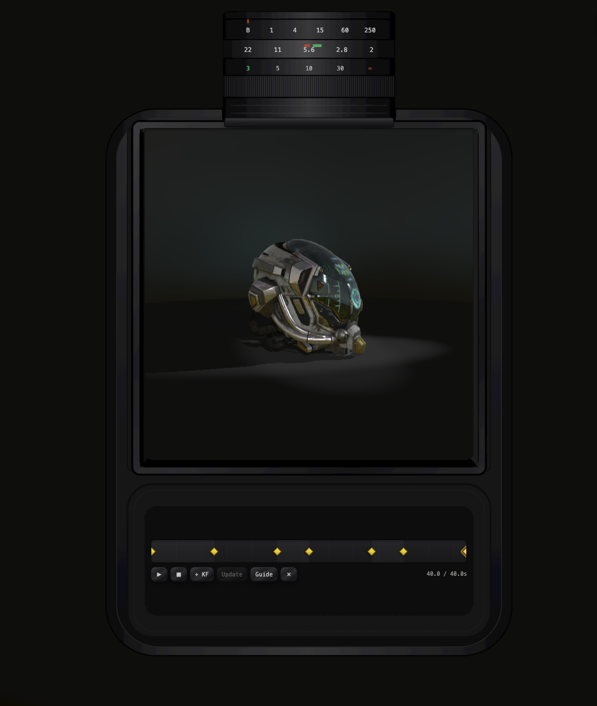
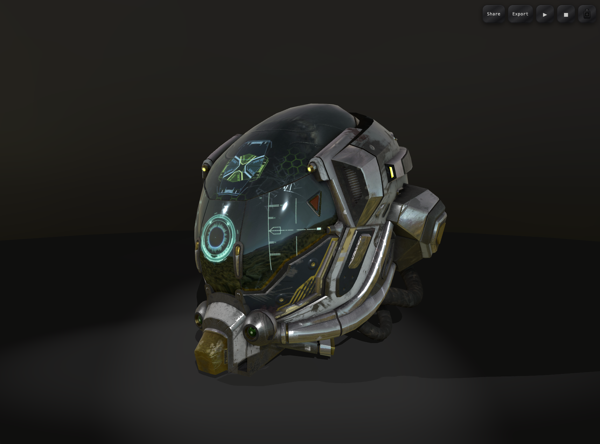

# Scene Viewer

**A free, open-source tool for turning GLB models into videos and embeddable 3D experiences.**

Load a model, light it, animate the camera, then ship the result as a **video export** or a **shareable URL** you can drop into a site as an interactive embed — no install, no account, no build step. Everything runs in the browser on the hosted app.

---

## Example

Night scene with a camera move around the example model:

[Live demo](https://higginsrob.github.io/sceneviewer/?scene=.%2Fscenes%2Fnight.json&target=https%3A%2F%2Fcdn.jsdelivr.net%2Fgh%2FKhronosGroup%2FglTF-Sample-Models%40main%2F2.0%2FDamagedHelmet%2FglTF-Binary%2FDamagedHelmet.glb&targetPosition=0%2C1.6218%2C0&targetScale=1.8&targetRotation=0%2C0%2C0&cameraPosition=-9.7647%2C2.7818%2C5.8586&fov=45&shadows=1&zoom=camera&guide=0&kf=7&keyframes=%5B%7B%22sceneUrl%22%3A%22.%2Fscenes%2Fnight.json%22%2C%22targetUrl%22%3A%22https%3A%2F%2Fcdn.jsdelivr.net%2Fgh%2FKhronosGroup%2FglTF-Sample-Models%40main%2F2.0%2FDamagedHelmet%2FglTF-Binary%2FDamagedHelmet.glb%22%2C%22targetPosition%22%3A%5B0%2C1.6218%2C0%5D%2C%22targetScale%22%3A%5B1.8%2C1.8%2C1.8%5D%2C%22targetRotation%22%3A%5B0%2C0%2C0%5D%2C%22cameraPosition%22%3A%5B-9.764699999999998%2C2.7817999999999996%2C5.858600000000002%5D%2C%22orbit%22%3A%7B%22distance%22%3A11.618596070601361%2C%22azimuthAngle%22%3A2.576000319869255%2C%22polarAngle%22%3A1.47078738149145%7D%2C%22fov%22%3A45%2C%22shadows%22%3Atrue%2C%22duration%22%3A8%2C%22easing%22%3A%22linear%22%7D%2C%7B%22sceneUrl%22%3A%22.%2Fscenes%2Fnight.json%22%2C%22targetUrl%22%3A%22https%3A%2F%2Fcdn.jsdelivr.net%2Fgh%2FKhronosGroup%2FglTF-Sample-Models%40main%2F2.0%2FDamagedHelmet%2FglTF-Binary%2FDamagedHelmet.glb%22%2C%22targetPosition%22%3A%5B0%2C1.6218%2C0%5D%2C%22targetScale%22%3A%5B1.8%2C1.8%2C1.8%5D%2C%22targetRotation%22%3A%5B0%2C0%2C0%5D%2C%22cameraPosition%22%3A%5B-5.6221000000000005%2C2.2426000000000004%2C-0.13679999999999973%5D%2C%22orbit%22%3A%7B%22distance%22%3A5.655374498672756%2C%22azimuthAngle%22%3A3.105991465230601%2C%22polarAngle%22%3A1.460798078753485%7D%2C%22fov%22%3A45%2C%22shadows%22%3Atrue%2C%22duration%22%3A8%2C%22easing%22%3A%22ease-in%22%7D%2C%7B%22sceneUrl%22%3A%22.%2Fscenes%2Fovercast.json%22%2C%22targetUrl%22%3A%22https%3A%2F%2Fcdn.jsdelivr.net%2Fgh%2FKhronosGroup%2FglTF-Sample-Models%40main%2F2.0%2FDamagedHelmet%2FglTF-Binary%2FDamagedHelmet.glb%22%2C%22targetPosition%22%3A%5B0%2C1.6218%2C0%5D%2C%22targetScale%22%3A%5B1.8%2C1.8%2C1.8%5D%2C%22targetRotation%22%3A%5B0%2C0%2C0%5D%2C%22cameraPosition%22%3A%5B-0.08999999999999955%2C2.1864%2C5.2896%5D%2C%22orbit%22%3A%7B%22distance%22%3A5.6553855398681145%2C%22azimuthAngle%22%3A1.585997053427932%2C%22polarAngle%22%3A1.4707908010546495%7D%2C%22fov%22%3A45%2C%22shadows%22%3Atrue%2C%22duration%22%3A4%2C%22easing%22%3A%22linear%22%7D%2C%7B%22sceneUrl%22%3A%22.%2Fscenes%2Fdusk.json%22%2C%22targetUrl%22%3A%22https%3A%2F%2Fcdn.jsdelivr.net%2Fgh%2FKhronosGroup%2FglTF-Sample-Models%40main%2F2.0%2FDamagedHelmet%2FglTF-Binary%2FDamagedHelmet.glb%22%2C%22targetPosition%22%3A%5B0%2C1.6218%2C0%5D%2C%22targetScale%22%3A%5B1.8%2C1.8%2C1.8%5D%2C%22targetRotation%22%3A%5B0%2C0%2C0%5D%2C%22cameraPosition%22%3A%5B5.4393%2C2.1864000000000003%2C1.0880000000000003%5D%2C%22orbit%22%3A%7B%22distance%22%3A5.655411722756298%2C%22azimuthAngle%22%3A0.25600190454395455%2C%22polarAngle%22%3A1.4707912656004163%7D%2C%22fov%22%3A45%2C%22shadows%22%3Atrue%2C%22duration%22%3A8%2C%22easing%22%3A%22linear%22%7D%2C%7B%22sceneUrl%22%3A%22.%2Fscenes%2Fnoon.json%22%2C%22targetUrl%22%3A%22https%3A%2F%2Fcdn.jsdelivr.net%2Fgh%2FKhronosGroup%2FglTF-Sample-Models%40main%2F2.0%2FDamagedHelmet%2FglTF-Binary%2FDamagedHelmet.glb%22%2C%22targetPosition%22%3A%5B0%2C1.6218%2C0%5D%2C%22targetScale%22%3A%5B1.8%2C1.8%2C1.8%5D%2C%22targetRotation%22%3A%5B0%2C0%2C0%5D%2C%22cameraPosition%22%3A%5B-3.907998850728888%2C2.431023667503681%2C6.721097922002709%5D%2C%22orbit%22%3A%7B%22distance%22%3A8.10601549708226%2C%22azimuthAngle%22%3A2.0759909636164875%2C%22polarAngle%22%3A1.4707963267948965%7D%2C%22fov%22%3A45%2C%22shadows%22%3Atrue%2C%22duration%22%3A0%2C%22easing%22%3A%22cut%22%7D%2C%7B%22sceneUrl%22%3A%22.%2Fscenes%2Fnoon.json%22%2C%22targetUrl%22%3A%22https%3A%2F%2Fcdn.jsdelivr.net%2Fgh%2FKhronosGroup%2FglTF-Sample-Models%40main%2F2.0%2FDamagedHelmet%2FglTF-Binary%2FDamagedHelmet.glb%22%2C%22targetPosition%22%3A%5B0%2C1.6218%2C0%5D%2C%22targetScale%22%3A%5B1.8%2C1.8%2C1.8%5D%2C%22targetRotation%22%3A%5B0%2C0%2C0%5D%2C%22cameraPosition%22%3A%5B-2.6816999999999998%2C1.9508000000000003%2C1.5567000000000002%5D%2C%22orbit%22%3A%7B%22distance%22%3A3.2956756145962913%2C%22azimuthAngle%22%3A2.5259911298303277%2C%22polarAngle%22%3A1.4707935827815548%7D%2C%22fov%22%3A45%2C%22shadows%22%3Atrue%2C%22duration%22%3A4%2C%22easing%22%3A%22linear%22%7D%2C%7B%22sceneUrl%22%3A%22.%2Fscenes%2Fstudio.json%22%2C%22targetUrl%22%3A%22https%3A%2F%2Fcdn.jsdelivr.net%2Fgh%2FKhronosGroup%2FglTF-Sample-Models%40main%2F2.0%2FDamagedHelmet%2FglTF-Binary%2FDamagedHelmet.glb%22%2C%22targetPosition%22%3A%5B0%2C1.6218%2C0%5D%2C%22targetScale%22%3A%5B1.8%2C1.8%2C1.8%5D%2C%22targetRotation%22%3A%5B0%2C0%2C0%5D%2C%22cameraPosition%22%3A%5B1.8058%2C1.9508000000000003%2C2.3973000000000004%5D%2C%22orbit%22%3A%7B%22distance%22%3A3.295612192549919%2C%22azimuthAngle%22%3A0.9859703302540657%2C%22polarAngle%22%3A1.4707916518484676%7D%2C%22fov%22%3A45%2C%22shadows%22%3Atrue%2C%22duration%22%3A8%2C%22easing%22%3A%22linear%22%7D%2C%7B%22sceneUrl%22%3A%22.%2Fscenes%2Fnight.json%22%2C%22targetUrl%22%3A%22https%3A%2F%2Fcdn.jsdelivr.net%2Fgh%2FKhronosGroup%2FglTF-Sample-Models%40main%2F2.0%2FDamagedHelmet%2FglTF-Binary%2FDamagedHelmet.glb%22%2C%22targetPosition%22%3A%5B0%2C1.6218%2C0%5D%2C%22targetScale%22%3A%5B1.8%2C1.8%2C1.8%5D%2C%22targetRotation%22%3A%5B0%2C0%2C0%5D%2C%22cameraPosition%22%3A%5B-9.764699999999998%2C2.7817999999999996%2C5.858600000000002%5D%2C%22orbit%22%3A%7B%22distance%22%3A11.618596070601361%2C%22azimuthAngle%22%3A2.576000319869255%2C%22polarAngle%22%3A1.47078738149145%7D%2C%22fov%22%3A45%2C%22shadows%22%3Atrue%2C%22duration%22%3A0%2C%22easing%22%3A%22linear%22%7D%5D)





---

## How to use it

1. Open [higginsrob.github.io/sceneviewer](https://higginsrob.github.io/sceneviewer/).
2. Press the **camera** button (top right) to enter **edit mode** — this switches into the viewfinder and unlocks the timeline and settings.
3. Open the **keyframe side panel** (chevron on the right). That’s where you pick a scene preset (Studio, Noon, Dusk, Night, Overcast), set the **GLB** URL, and adjust the selected keyframe (transform, FOV, shadows, duration, easing).
4. Frame each shot in the viewfinder, add keyframes on the timeline, and tweak per-keyframe settings in the side panel until the move looks right.
5. Ship it — see below.

Your model only needs to be reachable over HTTPS with CORS enabled (GitHub raw, jsDelivr, your own CDN, etc.). Paste the URL in the side panel — no fork or local server required.

---

## Videos and embeds

Once your scene and camera move look right, you can take either output:

### Export a video

Use **Export** to render the keyframe animation to a video file (choose aspect ratio, resolution, and FPS). Download it and use it anywhere — social, docs, presentations, product pages.

### Embed an interactive 3D experience

Use **Share** to copy a URL that restores the exact scene, model, camera, and keyframes. Anyone who opens that link gets a live, orbitable viewer — not a flat recording.

Drop the same URL into an iframe on your site:

```html
<iframe
  src="https://higginsrob.github.io/sceneviewer/?scene=./scenes/night.json&target=https://example.com/model.glb"
  width="100%"
  height="480"
  style="border:0"
  allow="fullscreen"
  title="3D scene"
></iframe>
```

Use **Share** in the app for a full URL with your keyframes baked in. The live demo link above is the same idea.

---

## URL parameters

Optional query params let you deep-link a specific setup. Use **Share** in the app to generate these automatically.


| Param                                               | Description                                                 |
| --------------------------------------------------- | ----------------------------------------------------------- |
| `scene`                                             | Path to a scene JSON (e.g. `./scenes/night.json`)           |
| `target`                                            | URL or path to a GLB                                        |
| `targetPosition` / `targetScale` / `targetRotation` | Comma-separated `x,y,z`                                     |
| `cameraPosition`                                    | Camera position `x,y,z`                                     |
| `fov`                                               | Field of view (10–120)                                      |
| `shadows`                                           | `1` / `0`                                                   |
| `zoom`                                              | `camera` for viewfinder framing, or omit for fullscreen     |
| `guide`                                             | `1` / `0` composition guides                                |
| `keyframes`                                         | JSON array of keyframe poses (from Share / Export workflow) |
| `kf`                                                | Selected keyframe index                                     |

---

## License

Free to use, fork, and adapt. If you ship something cool with it, a credit or star is appreciated.
